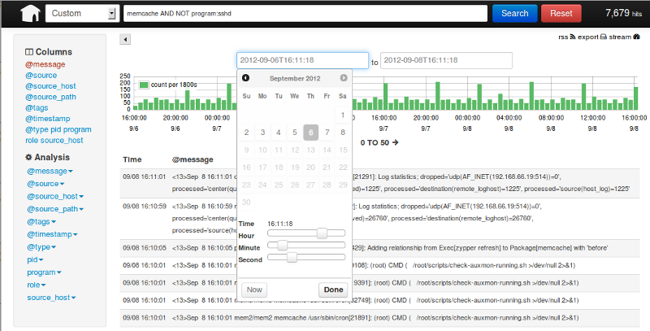
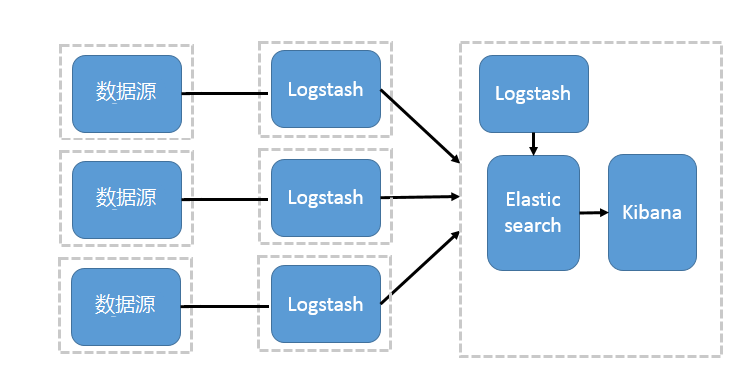

# 11.3 分布式系统的集中式日志解决方案

&emsp;&emsp;log4cpp很好用，能给我们的程序提供比较完备的日志方案，but，设想我们是一个分布式集群部署的系统，那么服务实例（可以简单理解有很多的服务器上运行了相同或者不同的服务程序）有很多个，那么我们定位问题时需要多个服务实例的日志信息，那在这样的系统，log4cpp很难解决这样的应用场景，有很多朋友也许会反映，log4cpp不是可以远程输出log吗，大家都往一个服务器上输出log不就可以了？
&emsp;&emsp;也许，上文提到的log4cpp远程输出能够解决这个问题，but，有一个开源的和更好的解决方案，江湖人称ELK，这个就是集中式日志解决方案。那ELK是啥？我们首先看下日志收集的一个Web界面。

&emsp;&emsp;ELK 不是一款软件，而是 Elasticsearch、Logstash 和 Kibana 三种软件产品的首字母缩写。这三者都是开源软件，通常配合使用，而且又先后归于 Elastic.co 公司名下，所以被简称为 ELK Stack。根据 Google Trend 的信息显示，ELK Stack 已经成为目前最流行的集中式日志解决方案。

* Elasticsearch：分布式搜索和分析引擎，具有高可伸缩、高可靠和易管理等特点。基于 Apache Lucene 构建，能对大容量的数据进行接近实时的存储、搜索和分析操作。通常被用作某些应用的基础搜索引擎，使其具有复杂的搜索功能；

* Logstash：数据收集引擎。它支持动态的从各种数据源搜集数据，并对数据进行过滤、分析、丰富、统一格式等操作，然后存储到用户指定的位置；
* Kibana：数据分析和可视化平台。通常与 Elasticsearch 配合使用，对其中数据进行搜索、分析和以统计图表的方式展示；
* Filebeat：ELK 协议栈的新成员，一个轻量级开源日志文件数据搜集器，基于 Logstash-Forwarder 源代码开发，是对它的替代。在需要采集日志数据的 server 上安装 Filebeat，并指定日志目录或日志文件后，Filebeat 就能读取数据，迅速发送到 Logstash 进行解析，亦或直接发送到 Elasticsearch 进行集中式存储和分析。
&emsp;&emsp;那么这是解决方案是如何架构设计的呢？

* 简单的架构
一个 Logstash、Elasticsearch 和 Kibana 实例。Logstash 通过输入插件从多种数据源（比如日志文件、标准输入 Stdin 等）获取数据，再经过滤插件加工数据，然后经 Elasticsearch 输出插件输出到 Elasticsearch，通过 Kibana 展示：

* Logstash 作为日志搜集器
这种架构是对上面架构的扩展，把一个 Logstash 数据搜集节点扩展到多个，分布于多台机器，将解析好的数据发送到 Elasticsearch server 进行存储，最后在 Kibana 查询、生成日志报表等，如下图：

* 基于 Filebeat 架构
Filebeat比起Logstash更加轻量，而且更加方便，所以在工业级项目中我们一般使用Filebeat替代logstash的日志采集器，那么这种架构是怎么样的呢？因为免费的 ELK 没有任何安全机制，所以这里使用了 Nginx 作反向代理，避免用户直接访问 Kibana 服务器。加上配置 Nginx 实现简单的用户认证，一定程度上提高安全性。另外，Nginx 本身具有负载均衡的作用，能够提高系统访问性能。
