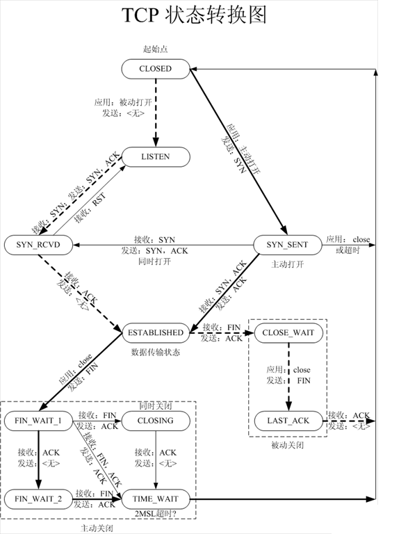
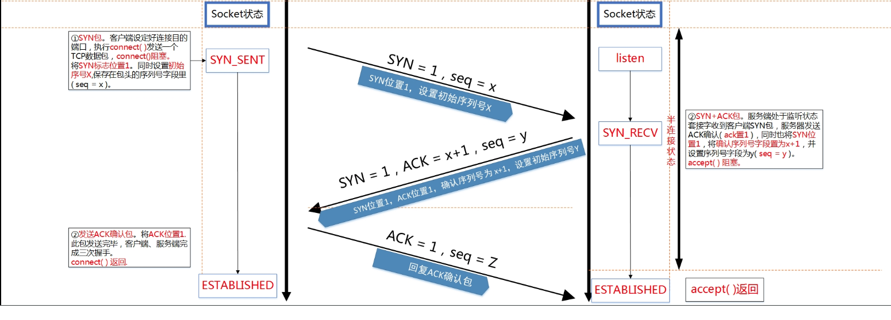

# 15.4 TCP原理介绍

* [TCP协议头解释](#tcpheader)
* [TCP建立连接的三次握手](#tcp3handshak)
* [TCP连接断开的四次挥手](#tcp4bye)
* [TCP的状态机](#tcp_state)
* [listen时的指定的backlog含义](#listen)


<h3 id="tcpheader">TCP协议头解释</h3> 

tcp协议头格式如下：


**详细解析**
16位源端口号和16位目的端口号。
32位序号：一次TCP通信过程中某一个传输方向上的字节流的每个字节的编号，通过这个来确认发送的数据有序，比如现在序列号为1000，发送了1000，下一个序列号就是2000。
32位确认号：用来响应TCP报文段，给收到的TCP报文段的序号加1，三握时还要携带自己的序号。
4位头部长度：标识该TCP头部有多少个4字节，共表示最长15\*4=60字节。同IP头部。
6位保留。6位标志。URG（紧急指针是否有效）ACK（表示确认号是否有效）PSH（提示接收端应用程序应该立即从TCP接收缓冲区读走数据）RST（表示要求对方重新建立连接）SYN（表示请求建立一个连接）FIN（表示通知对方本端要关闭连接）
16位窗口大小：TCP流量控制的一个手段，用来告诉对端TCP缓冲区还能容纳多少字节。
16位校验和：由发送端填充，接收端对报文段执行CRC算法以检验TCP报文段在传输中是否损坏。
16位紧急指针：一个正的偏移量，它和序号段的值相加表示最后一个紧急数据的下一字节的序号。

<h3 id="tcp3handshak">TCP建立连接的三次握手</h3>


为什么需要三次握手？

**三次握手：**
“喂，你听得到吗？”
“我听得到呀，你听得到我吗？”
“我能听到你，今天balabala……”

**两次握手：**
“喂，你听得到吗？”
“我听得到呀”
“喂喂，你听得到吗？”
“草，我听得到呀！！！！”
“你TM能不能听到我讲话啊！！喂！”
“……”

**四次握手：**
“喂，你听得到吗？”
“我听得到呀，你听得到我吗？”
“我能听到你，你能听到我吗？”
“……不想跟傻逼说话”

TCP作为一种可靠传输控制协议，其核心思想：**既要保证数据可靠传输，又要提高传输的效率**，而用三次恰恰可以满足以上两方面的需求！TCP可靠传输的精髓：TCP连接的一方A，由操作系统动态随机选取一个32位长的序列号（Initial Sequence Number），假设A的初始序列号为1000，以该序列号为原点，对自己将要发送的每个字节的数据进行编号，1001，1002，1003…，并把自己的初始序列号ISN告诉B，让B有一个思想准备，什么样编号的数据是合法的，什么编号是非法的，比如编号900就是非法的，同时B还可以对A每一个编号的字节数据进行确认。如果A收到B确认编号为2001，则意味着字节编号为，共1000个字节已经安全到达。同理B也是类似的操作，假设B的初始序列号ISN为2000，以该序列号为原点，对自己将要发送的每个字节的数据进行编号，2001，2002，2003…，并把自己的初始序列号ISN告诉A，以便A可以确认B发送的每一个字节。如果B收到A确认编号为4001，则意味着字节编号为，共2000个字节已经安全到达。  
**一句话概括，TCP连接握手，握的是啥？通信双方数据原点的序列号！**

<h3 id="tcp4bye">TCP连接断开的四次挥手</h3>


TCP连接的释放一共需要四步，因此称为『四次挥手』。   
我们知道，TCP连接是双向的，因此在四次挥手中，前两次挥手用于断开一个方向的连接，后两次挥手用于断开另一方向的连接。  
* 第一次挥手  
若A认为数据发送完成，则它需要向B发送连接释放请求。该请求只有报文头，头中携带的主要参数为： FIN=1，seq=u。此时，A将进入FIN-WAIT-1状态。PS1：FIN=1表示该报文段是一个连接释放请求。PS2：seq=u，u-1是A向B发送的最后一个字节的序号。  
* 第二次挥手   
B收到连接释放请求后，会通知相应的应用程序，告诉它A向B这个方向的连接已经释放。此时B进入CLOSE-WAIT状态，并向A发送连接释放的应答，其报文头包含： ACK=1，seq=v，ack=u+1。PS1：ACK=1：除TCP连接请求报文段以外，TCP通信过程中所有数据报的ACK都为1，表示应答。PS2：seq=v，v-1是B向A发送的最后一个字节的序号。PS3：ack=u+1表示希望收到从第u+1个字节开始的报文段，并且已经成功接收了前u个字节。A收到该应答，进入FIN-WAIT-2状态，等待B发送连接释放请求。第二次挥手完成后，A到B方向的连接已经释放，B不会再接收数据，A也不会再发送数据。但B到A方向的连接仍然存在，B可以继续向A发送数据。
* 第三次挥手  
当B向A发完所有数据后，向A发送连接释放请求，请求头：FIN=1，ACK=1，seq=w，ack=u+1。B便进入LAST-ACK状态。
* 第四次挥手  
A收到释放请求后，向B发送确认应答，此时A进入TIME-WAIT状态。该状态会持续2MSL时间，若该时间段内没有B的重发请求的话，就进入CLOSED状态，撤销TCB。当B收到确认应答后，也便进入CLOSED状态，撤销TCB。  
* 为什么A要先进入TIME-WAIT状态，等待2MSL时间后才进入CLOSED状态？  
为了保证B能收到A的确认应答。 若A发完确认应答后直接进入CLOSED状态，那么如果该应答丢失，B等待超时后就会重新发送连接释放请求，但此时A已经关闭了，不会作出任何响应，因此B永远无法正常关闭。

<h3 id="tcp_state">TCP的状态机</h3>



[TCP的状态机](https://www.cnblogs.com/yhp-smarthome/p/7102488.html)


<h3 id="listen">listen时的指定的backlog含义</h3> 

我们先来看下listen的声明：
```
int listen(int sockfd, int backlog);
```  
有关于第二个参数含义的问题网上有好几种说法，我总结了下主要有这么3种：

* Kernel会为LISTEN状态的socket维护一个队列，其中存放SYN RECEIVED和ESTABLISHED状态的套接字，backlog就是这个队列的大小。  
* Kernel会为LISTEN状态的socket维护两个队列，一个是SYN RECEIVED状态，另一个是ESTABLISHED状态，而backlog就是这两个队列的大小之和。  
* 第三种和第二种模型一样，但是backlog是队列ESTABLISHED的长度。  

有关上面说的两个状态SYN RECEIVED状态和ESTABLISHED状态，是TCP三次握手过程中的状态转化，具体可以参考下面的图（在新窗口打开图片）：


当一个应用使用listen系统调用让socket进入LISTEN状态时，它需要为该套接字指定一个backlog。backlog通常被描述为连接队列的限制。  
由于TCP使用的3次握手，连接在到达ESTABLISHED状态之前经历中间状态SYN RECEIVED，并且可以由accept系统调用返回到应用程序。这意味着TCP / IP堆栈有两个选择来为LISTEN状态的套接字实现backlog队列：  
1：使用单个队列实现，其大小由listen syscall的backlog参数确定。 当收到SYN数据包时，它发送回SYN/ACK数据包，并将连接添加到队列。 当接收到相应的ACK时，连接将其状态改变为已建立。 这意味着队列可以包含两种不同状态的连接：SYN RECEIVED和ESTABLISHED。 只有处于后一状态的连接才能通过accept syscall返回给应用程序。

2 ： 使用两个队列实现，一个SYN队列（或半连接队列）和一个accept队列（或完整的连接队列）。 处于SYN RECEIVED状态的连接被添加到SYN队列，并且当它们的状态改变为ESTABLISHED时，即当接收到3次握手中的ACK分组时，将它们移动到accept队列。 显而易见，accept系统调用只是简单地从完成队列中取出连接。 在这种情况下，listen syscall的backlog参数表示完成队列的大小。

历史上，BSD 派生系统实现的TCP使用第一种方法。 该选择意味着当达到最大backlog时，系统将不再响应于SYN分组发送回SYN/ACK分组。 通常，TCP的实现将简单地丢弃SYN分组，使得客户端重试。

在Linux上，是和上面不同的。如在listen系统调用的手册中所提到的： 
在Linux内核2.2之后，socket backlog参数的形为改变了，现在它指等待accept的完全建立的套接字的队列长度，而不是不完全连接请求的数量。 不完全连接的长度可以使用/proc/sys/net/ipv4/tcp_max_syn_backlog设置。这意味着当前Linux版本使用上面第二种说法，有两个队列：具有由系统范围设置指定的大小的SYN队列 和 应用程序（也就是backlog参数）指定的accept队列。  

OK，说到这里，相信backlog含义已经解释的非常清楚了，下面我们用实验验证下这种说法：

OK，这个著名的设计，给我们带来了很大的麻烦，这个麻烦就是DDOS攻击。
可参见链接：  
