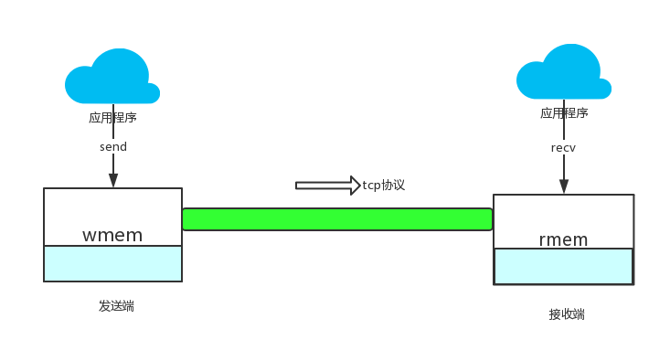
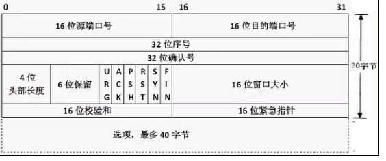
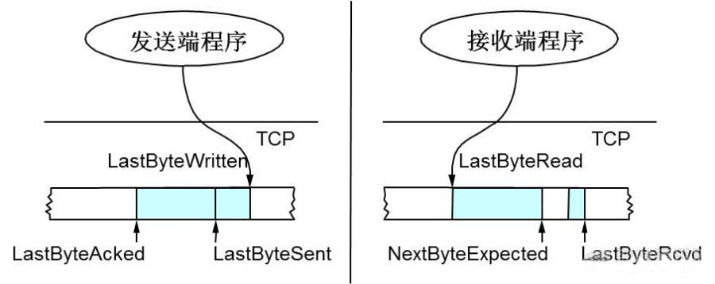
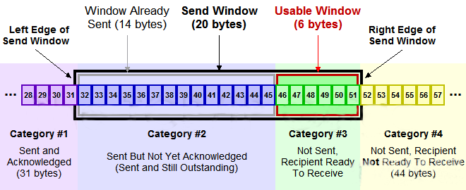
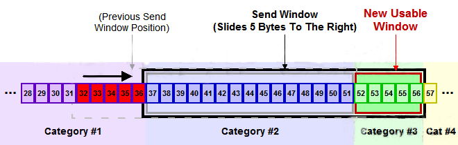
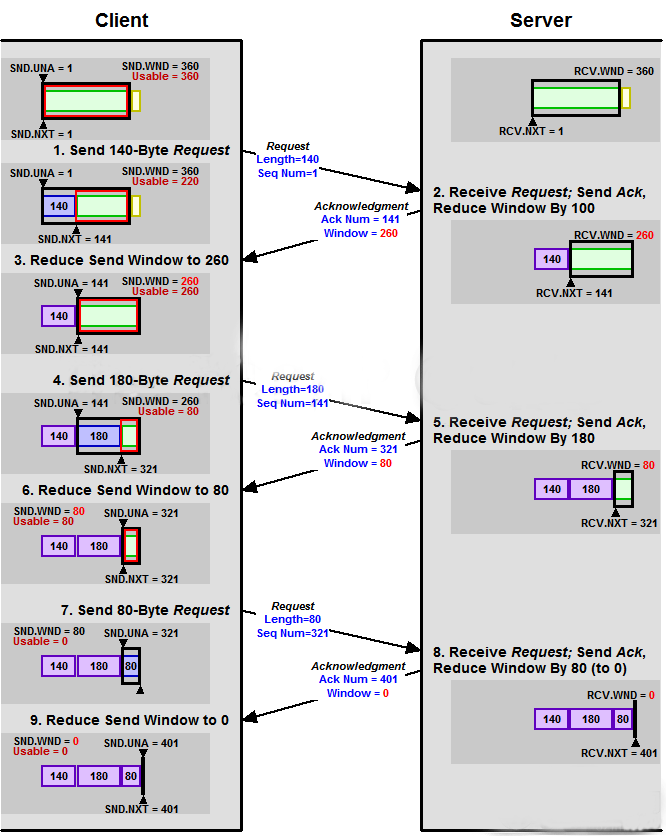

# 18.1 滑动窗口

我们再来看这个比喻：


网络仅仅是保证了整个网络的连通性，我们我们基于整个网络去传输，那么是不是我想发送多少数据就发送多少数据呢？如果是这样的话，是不是就会像我们的从一个池塘抽水去灌到另外一个池塘一样，想抽多少水就抽多少水，这是肯定不行的，因为我们不能让接收水的池塘溢出水了。那么在TCP协议中是如何控制的？

对于每一个socket，都有一个接收缓存，和发送缓存，对于接收端来讲，我们必须确保这个接收缓存不能溢出，为了做到如此，那么接收端在回复ACK时，必须通告这个接收缓存的可用空间有多大，OK，我们来看看TCP协议。  

TCP头里定义了这个窗口大小的值。是由接收端回复ACK时填充的。于是发送端就可以根据这个接收端的窗口大小来发送数据，而不会导致接收端处理不过来。好了，为了说明整个滑动窗口，我们来看看整个tcp协议控制的数据结构。  


从上图我们可知：
* 接收端LastByteRead指向了TCP缓冲区中读到的位置，NextByteExpected指向的地方是收到的连续包的最后一个位置，LastByteRcved指向的是收到的包的最后一个位置，我们可以看到中间有些数据还没有到达，所以有数据空白区。
* 发送端的LastByteAcked指向了被接收端Ack过的位置（表示成功发送确认），LastByteSent表示发出去了，但还没有收到成功确认的Ack，LastByteWritten指向的是上层应用正在写的地方。
于是：
* 接收端在给发送端回ACK中会汇报自己的AdvertisedWindow = MaxRcvBuffer – LastByteRcvd – 1;
* 而发送方会根据这个窗口来控制发送数据的大小，以保证接收方可以处理。

那接收端是如何控制发送端的发送呢？首先，我们来看这个AdvertisedWindow在发送端是如何控制的，首先看这个布局：


上图中分成了四个部分，分别是：（其中那个黑模型就是滑动窗口）

#1 已收到ack确认的数据。
#2 发还没收到ack的。
#3 在窗口中还没有发出的（接收方还有空间）。
#4 窗口以外的数据（接收方没空间）

既然说是滑动窗口，那这个窗口是如何调整的呢？且看下图：


下面我们来看一下整个控制流程：  


**Zero Window**
上图，我们可以看到一个处理缓慢的Server（接收端）是怎么把Client（发送端）的TCP Sliding Window给降成0的。此时，你一定会问，如果Window变成0了，TCP会怎么样？是不是发送端就不发数据了？是的，发送端就不发数据了，你可以想像成“Window Closed”，那你一定还会问，如果发送端不发数据了，接收方一会儿Window size 可用了，怎么通知发送端呢？

解决这个问题，TCP使用了Zero Window Probe技术，缩写为ZWP，也就是说，发送端在窗口变成0后，会发ZWP的包给接收方，让接收方来ack他的Window尺寸，一般这个值会设置成3次，第次大约30-60秒（不同的实现可能会不一样）。如果3次过后还是0的话，有的TCP实现就会发RST把链接断了。

注意：只要有等待的地方都可能出现DDoS攻击，Zero Window也不例外，一些攻击者会在和HTTP建好链发完GET请求后，就把Window设置为0，然后服务端就只能等待进行ZWP，于是攻击者会并发大量的这样的请求，把服务器端的资源耗尽。

另外，Wireshark中，你可以使用tcp.analysis.zero_window来过滤包，然后使用右键菜单里的follow TCP stream，你可以看到ZeroWindowProbe及ZeroWindowProbeAck的包。

**Silly Window Syndrome**

Silly Window Syndrome翻译成中文就是“糊涂窗口综合症”。正如你上面看到的一样，如果我们的接收方太忙了，来不及取走Receive Windows里的数据，那么，就会导致发送方越来越小。到最后，如果接收方腾出几个字节并告诉发送方现在有几个字节的window，而我们的发送方会义无反顾地发送这几个字节。

要知道，我们的TCP+IP头有40个字节，为了几个字节，要达上这么大的开销，这太不经济了。

另外，你需要知道网络上有个MTU，对于以太网来说，MTU是1500字节，除去TCP+IP头的40个字节，真正的数据传输可以有1460，这就是所谓的MSS（Max Segment Size）注意，TCP的RFC定义这个MSS的默认值是536，这是因为 RFC 791里说了任何一个IP设备都得最少接收576尺寸的大小（实际上来说576是拨号的网络的MTU，而576减去IP头的20个字节就是536）。

如果你的网络包可以塞满MTU，那么你可以用满整个带宽，如果不能，那么你就会浪费带宽。（大于MTU的包有两种结局，一种是直接被丢了，另一种是会被重新分块打包发送） 你可以想像成一个MTU就相当于一个飞机的最多可以装的人，如果这飞机里满载的话，带宽最高，如果一个飞机只运一个人的话，无疑成本增加了，也而相当二。

所以，Silly Windows Syndrome这个现像就像是你本来可以坐200人的飞机里只做了一两个人。 要解决这个问题也不难，就是避免对小的window size做出响应，直到有足够大的window size再响应，这个思路可以同时实现在sender和receiver两端：

* 如果这个问题是由Receiver端引起的，那么就会使用 David D Clark’s 方案。在receiver端，如果收到的数据导致window size小于某个值，可以直接ack(0)回sender，这样就把window给关闭了，也阻止了sender再发数据过来，等到receiver端处理了一些数据后windows size 大于等于了MSS，或者，receiver buffer有一半为空，就可以把window打开让send 发送数据过来。
* 如果这个问题是由Sender端引起的，那么就会使用著名的 Nagle’s algorithm。这个算法的思路也是延时处理，他有两个主要的条件：1）要等到 Window Size>=MSS 或是 Data Size >=MSS，2）收到之前发送数据的ack回包，他才会发数据，否则就是在攒数据。

另外，Nagle算法默认是打开的，所以，对于一些需要小包场景的程序——比如像telnet或ssh这样的交互性比较强的程序，你需要关闭这个算法。你可以在Socket设置TCP_NODELAY选项来关闭这个算法（关闭Nagle算法没有全局参数，需要根据每个应用自己的特点来关闭）
```	
	setsockopt(sock_fd, IPPROTO_TCP, TCP_NODELAY, (char \*)&value,sizeof(int));
```
另外，网上有些文章说TCP_CORK的socket option是也关闭Nagle算法，这不对。TCP_CORK其实是更新激进的Nagle算法，完全禁止小包发送，而Nagle算法没有禁止小包发送，只是禁止了大量的小包发送。最好不要两个选项都设置。


