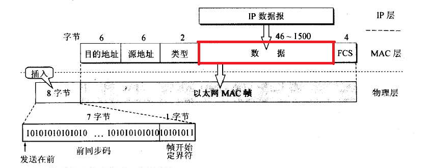

# 18.2 MTU

MTU（Maximum Transmission Unit）是什么鬼东西呢？实际上我们再来看看数据链路层的结构。  

MTU就是上图红色框部分的大小，这一部分规定了网络层数据的大小最大为1500个字节，网络层必须确保不超过1500个字节，否则数据链路层会把这个包给舍弃掉。于此，对于TCP协议来讲，因为IP头为20个字节，TCP头为20个字节，所以，TCP协议能传输的数据最大为1460（1500 - 20 - 20），这个值称为MSS（Maxitum Segment Size）。

那么这个值MSS或者说MTU对我们编程实现有什么作用呢？且听课堂分解。
