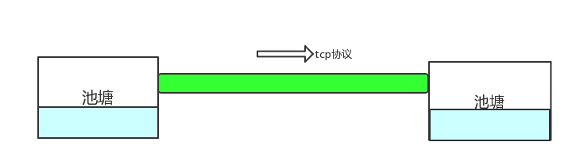

# 第18节   TCP的滑动窗口和拥塞控制

我们说TCP可靠，除了对乱序包进行排序，对丢失的包进行重发，使用ACE确认收到的包以外，还有很多更加复杂的算法，我们可以把TCP类比如下：

也就是说TCP协议就像一根管道，连接着两个池塘，保证从一个池塘往另一个池塘输送水，那么在这个过程中就要保证两件事情，一个是保证接收水的池塘的水不能溢出池塘了，这个手段在TCP中使用的是滑动窗口，它要控制发送和接收端处理速率达到一个平衡；另一个是要保证尽可能快的把送水池塘的水输送到接收水的池塘，因为如果TCP这跟管道里如果水没有塞满，那输送水肯定很慢，如果输送水过快，那管子会爆裂，后果就是谁都输送不了水，这个手段在TCP中是使用拥塞控制算法。

OK，如果你说你不懂滑动窗口和拥塞控制，你就不懂TCP协议，而且也不懂如何使用。试想一下，如果你要做一个软件升级，或者是一些音视频传输，或者是后台各个服务模块之间传输数据，那如何尽可能提高整个系统的处理能力和处理的效率呢？这就必须要了解TCP的各个特性了，你才能更好地解决系统的性能瓶颈。

