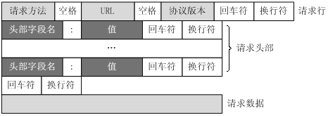
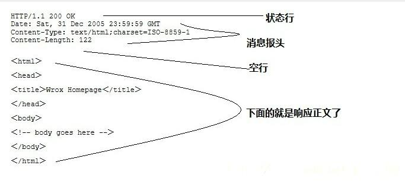

# 19.1 http协议介绍

HTTP协议是Hyper Text Transfer Protocol（超文本传输协议）的缩写,最开始是用于从万维网（WWW:World Wide Web ）服务器传输超文本到本地浏览器的传送协议。说它是超文本的意思是，它所有的信息都是文本信息，都是明文传输的。

* [请求数据格式](#request)
* [应答数据格式](#response)
* [http的原理](#theory)

<h3 id="request">请求数据格式</h3>

另外，http是一种请求应答模式，一请求一应答的模式，那么我们首先来看下请求数据包的格式吧：


一行为单位对数据进行组织的。OK，我们先来看一个实例吧：
```
GET / HTTP/1.1
Host: wx.qq.com
Connection: keep-alive
Cache-Control: max-age=0
Upgrade-Insecure-Requests: 1
User-Agent: Mozilla/5.0 (Windows NT 10.0; WOW64) AppleWebKit/537.36 (KHTML, like Gecko) Chrome/68.0.3440.106 Safari/537.36
Accept: text/html,application/xhtml+xml,application/xml;q=0.9,image/webp,image/apng,*/*;q=0.8
Accept-Encoding: gzip, deflate, br
Accept-Language: zh-CN,zh;q=0.9,en;q=0.8

```

或者：  
```

GET /qrcode/QaJNAK9NLg== HTTP/1.1
Host: login.weixin.qq.com
Connection: keep-alive
User-Agent: Mozilla/5.0 (Windows NT 10.0; WOW64) AppleWebKit/537.36 (KHTML, like Gecko) Chrome/68.0.3440.106 Safari/537.36
Accept: image/webp,image/apng,image/*,*/*;q=0.8
Referer: https://wx.qq.com/
Accept-Encoding: gzip, deflate, br
Accept-Language: zh-CN,zh;q=0.9,en;q=0.8

```
* 请求行

请求行以一个方法符号开头，以空格分开，后面跟着请求的URL和协议的版本。
http支持的请求方法如下：  
|序号 |	方法 |	描述 |
|-------|---------|------|
|1	|GET	|请求指定的页面信息，并返回实体主体。|
|2	|HEAD	|类似于get请求，只不过返回的响应中没有具体的内容，用于获取报头|
|3	|POST	|向指定资源提交数据进行处理请求（例如提交表单或者上传文件）。数据被包含在请求体中。POST请求可能会导致新的资源的建立和/或已有资源的修改。|
|4	|PUT	|从客户端向服务器传送的数据取代指定的文档的内容。|
|5	|DELETE	|请求服务器删除指定的页面。|
|6	|CONNECT	|HTTP/1.1协议中预留给能够将连接改为管道方式的代理服务器。|
|7	|OPTIONS	|允许客户端查看服务器的性能。|
|8	|TRACE	|回显服务器收到的请求，主要用于测试或诊断。|

**URL是uniform resource locator，统一资源定位器，它是一种具体的URI，即URL可以用来标识一个资源，而且还指明了如何locate这个资源。**
URL是Internet上用来描述信息资源的字符串，主要用在各种WWW客户程序和服务器程序上，特别是著名的Mosaic。
采用URL可以用一种统一的格式来描述各种信息资源，包括文件、服务器的地址和目录等。URL一般由三部组成：
① 协议(或称为服务方式)
② 存有该资源的主机IP地址(有时也包括端口号)
③ 主机资源的具体地址。如目录和文件名等

2. 请求头部

请求报头允许客户端向服务器端传递请求的附加信息以及客户端自身的信息。
常用的请求报头
**Accept**
Accept请求报头域用于指定客户端接受哪些类型的信息。eg：Accept：image/gif，表明客户端希望接受GIF图象格式的资源；Accept：text/html，表明客户端希望接受html文本。
**Accept-Charset**
Accept-Charset请求报头域用于指定客户端接受的字符集。eg：Accept-Charset:iso-8859-1,gb2312.如果在请求消息中没有设置这个域，缺省是任何字符集都可以接受。
**Accept-Encoding**
Accept-Encoding请求报头域类似于Accept，但是它是用于指定可接受的内容编码。eg：Accept-Encoding:gzip.deflate.如果请求消息中没有设置这个域服务器假定客户端对各种内容编码都可以接受。
**Accept-Language**
Accept-Language请求报头域类似于Accept，但是它是用于指定一种自然语言。eg：Accept-Language:zh-cn.如果请求消息中没有设置这个报头域，服务器假定客户端对各种语言都可以接受。
**Authorization**
Authorization请求报头域主要用于证明客户端有权查看某个资源。当浏览器访问一个页面时，如果收到服务器的响应代码为401（未授权），可以发送一个包含Authorization请求报头域的请求，要求服务器对其进行验证。
**Host（发送请求时，该报头域是必需的）**
Host请求报头域主要用于指定被请求资源的Internet主机和端口号，它通常从HTTP URL中提取出来的，eg：
我们在浏览器中输入：http://www.guet.edu.cn/index.html
浏览器发送的请求消息中，就会包含Host请求报头域，如下：
Host：www.guet.edu.cn
此处使用缺省端口号80，若指定了端口号，则变成：Host：www.guet.edu.cn:指定端口号
**User-Agent**
我们上网登陆论坛的时候，往往会看到一些欢迎信息，其中列出了你的操作系统的名称和版本，你所使用的浏览器的名称和版本，这往往让很多人感到很神奇，实际上，服务器应用程序就是从User-Agent这个请求报头域中获取到这些信息。User-Agent请求报头域允许客户端将它的操作系统、浏览器和其它属性告诉服务器。不过，这个报头域不是必需的，如果我们自己编写一个浏览器，不使用User-Agent请求报头域，那么服务器端就无法得知我们的信息了。
**Content-Type**
关于字符的编码，1.0版规定，头信息必须是 ASCII 码，后面的数据可以是任何格式。因此，服务器回应的时候，必须告诉客户端，数据是什么格式，这就是Content-Type字段的作用。

下面是一些常见的Content-Type字段的值：
```
text/plain
text/html
text/css
image/jpeg
image/png
image/svg+xml
audio/mp4
video/mp4
application/javascript
application/pdf
application/zip
application/atom+xml

```

**Content-Encoding**
由于发送的数据可以是任何格式，因此可以把数据压缩后再发送。Content-Encoding字段说明数据的压缩方法。
```
Content-Encoding: gzip
Content-Encoding: compress
Content-Encoding: deflate

```
客户端在请求时，用Accept-Encoding字段说明自己可以接受哪些压缩方法。
```
Accept-Encoding: gzip, deflate

```

* 空行，请求头部之后的空行是必须的

* 请求数据：请求数据也叫消息体，可以添加任意的其他数据。

<h3 id="response">应答数据格式</h3>
应答数据格式如下：  




例子：
```
HTTP/1.1 200 OK
Connection: keep-alive
Content-Type: text/javascript
Content-Length: 16

window.code=408;

```

第一部分：状态行，由HTTP协议版本号， 状态码， 状态消息 三部分组成。
第一行为状态行，（HTTP/1.1）表明HTTP版本为1.1版本，状态码为200，状态消息为（ok）

第二部分：消息报头，用来说明客户端要使用的一些附加信息

第二行到第四行为消息报头，
Content-Type:指定了消息体的内容为text/javascript格式的；  
Content-Length:

第三部分：空行，消息报头后面的空行是必须的

第四部分：响应正文，服务器返回给客户端的文本信息。
例子中是“window.code=408”

其实，请求头和回应头都是一样格式的。

状态代码有三位数字组成，第一个数字定义了响应的类别，共分五种类别:

1xx：指示信息--表示请求已接收，继续处理
2xx：成功--表示请求已被成功接收、理解、接受
3xx：重定向--要完成请求必须进行更进一步的操作
4xx：客户端错误--请求有语法错误或请求无法实现
5xx：服务器端错误--服务器未能实现合法的请求

常见的状态码有：
```
200 OK                   //客户端请求成功
400 Bad Request             //客户端请求有语法错误，不能被服务器所理解
401 Unauthorized            // 请求未经授权，这个状态代码必须和WWW-Authenticate报头域一起使用 
403 Forbidden              //服务器收到请求，但是拒绝提供服务
404 Not Found              //请求资源不存在，eg：输入了错误的URL
500 Internal Server Error      //服务器发生不可预期的错误
503 Server Unavailable        //服务器当前不能处理客户端的请求，一段时间后可能恢复正常
```

<h3 id="theory">http的原理</h3>

http属于应用层的消息，底层的传输协议是tcp，晚上我们会抓包来具体分析下？

也正因为http是明文传输的，相对来说，浪费了很多的带宽（相对那些使用TLV格式定义的协议，以TCP协议承载传输来说），也正是因为这一点，导致http协议不是一种安全的协议，因为我们完全可以在网络上抓取一个http包，然后进行重放攻击。

那如何做到http的安全传输呢？

这是一个很长的话题，我们先把这个记下来，将来在服务器开发的尾端来介绍。

