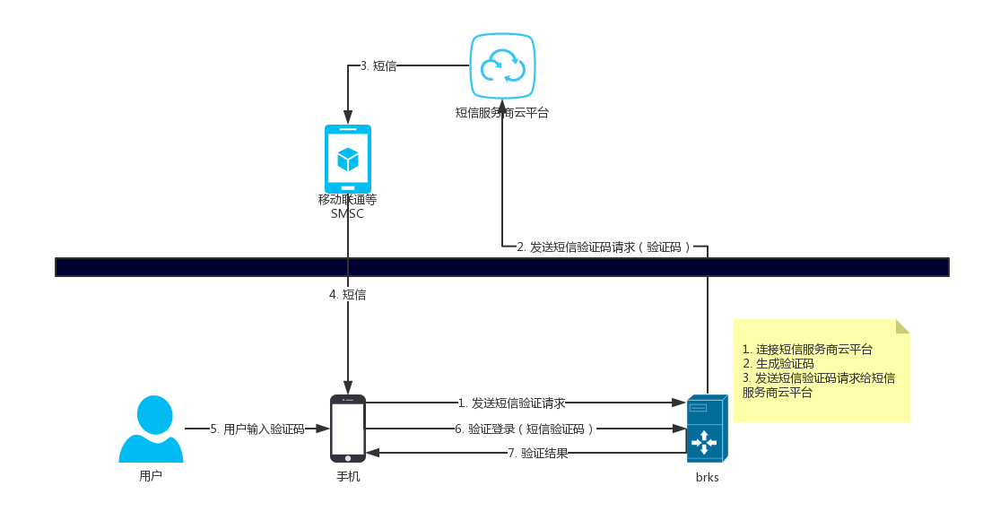

# 19.3 短信验证码

用户使用短信验证码登录系统，一者验证了用户手机的合法性，比如整个手机号码正在被所持有者使用等等，防止了盗取了别人账户信息等，强迫输入短信验证码，也避免了一部分攻击。当然除了短信验证码的，我们还看见过使用电子邮箱进行验证的。

* 6位数字的随机码如何生成？

```
std::string UserEventHandler::code_gen()
{
    unsigned int code = 0;
    srand((unsigned int)time(NULL));

    code = (unsigned int)(rand() % (999999 - 100000) + 1000000);

    char buffer[20] = {0};
    sprintf(buffer, "%d", code);
    strcpy(buffer, buffer + 1);

    return std::string(buffer);
}

```

* 如何发送短信验证码？

发送短信时，我们一定需要短信服务提供商，我们向提供商发送短信服务请求，由他们向目的手机发送短信验证码。具体的工作流程为：


