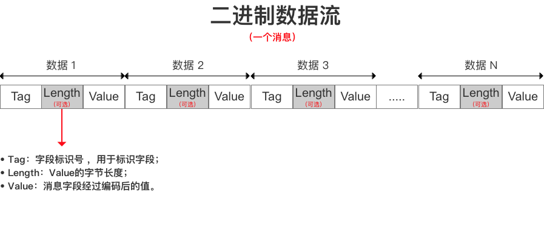

# protobuf序列化

protobuf是一种比json和xml等序列化工具更加轻量和高效的结构化数据存储格式，性能比json和xml真的强很多，毕竟是google出品的。

## 参考链接
[protocol buffer官网](https://developers.google.com/protocol-buffers/)

## protobuf的安装
```
$ git clone https://github.com/protocolbuffers/protobuf.git
$ cd protobuf
$ git submodule update --init --recursive
$ ./autogen.sh
$ ./configure
$ make
$ make check
$ sudo make install
$ sudo ldconfig
```

## protobuf的应用

### 定义message
所有的message必须定义到一个文件中，且文件的后缀名为.proto。例如我们定义的proto文件

```
syntax = "proto2";

package tutorial;

message rsponse_result
{
    required int32  code = 1;  //返回编码
    required string msg  = 2;   //返回信息
    optional string data = 3; //其他数据
}

message mobile_request
{
    required string mobile = 1;
}

message login_request
{
    required string mobile = 1;  // 手机号码
    required int32  code   = 2;    // 验证码
}

message recharge_request
{
    required string mobile = 1;
    required int32  amount = 2;    
}

message account_balance_request
{
    required string mobile = 1;
}

message account_balance_response
{
    required rsponse_result ret     = 1;
    required int32          balance = 2;
}

message list_account_records_request
{
    required string mobile = 1;
}

message list_account_records_response
{
    required rsponse_result ret = 1;
    message account_record
    {
        required int32  type      = 1; // 0 : 骑行消费,  1 : 充值, 2 : 退款
        required int32  limit     = 2; // 消费或者充值金额
        required uint64 timestamp = 3; // 记录发生时的时间戳
    }
    
    repeated account_record records = 2;
}

message list_travel_records_request
{
    required string mobile = 1;
}

message list_travel_records_rsponse
{
    required rsponse_result ret = 1;
    message travel_record
    {
        required uint64 stm      = 1;   // start timestamp
        required uint32 duration = 2;   // 骑行时长
        required uint32 amount   = 3;   // 所耗金额
    }
    
    required double              mileage   = 2; // 里程
    required double              discharge = 3; // 排放
    required double              calorie   = 4; // 卡路里
    repeated travel_record       records   = 5;
}

```

### 编译mesage文件
编译语法：

```
protoc -I=$SRC_DIR --cpp_out=$DST_DIR $SRC_DIR/addressbook.proto

```
SRC_DIR 表示proto文件所在的目录，cpp_out指定了生成的代码的路径，$SRC_DIR/addressbook.proto指proto文件。
```
protoc -I=./ --cpp_out=./ protocol.proto
```
这样在当前目录生成了protocol.pb.cc和protocol.pb.h两个文件。

### 应用protobuf

把生成了protocol.pb.cc和protocol.pb.h加入到工程，那么接着就是调用一些API，完成序列化和反序列化。参考：    
[API说明](https://developers.google.com/protocol-buffers/docs/reference/cpp/google.protobuf.message)

### protobuf的原理




### proto2和proto3的区别

总的来说，proto3 比 proto2 支持更多语言但 更简洁。去掉了一些复杂的语法和特性，更强调约定而弱化语法。如果是首次使用 Protobuf ，建议使用 proto3 。

1. 在第一行非空白非注释行，必须写：
syntax = "proto3";
字段规则移除了 “required”，并把 “optional” 改名为 “singular”1；

2. 在 proto2 中 required 也是不推荐使用的。proto3 直接从语法层面上移除了 required 规则。其实可以做的更彻底，把所有字段规则描述都撤销，原来的 repeated 改为在类型或字段名后加一对中括号。这样是不是更简洁？

3. “repeated”字段默认采用 packed 编码；
在 proto2 中，需要明确使用 [packed=true] 来为字段指定比较紧凑的 packed 编码方式。

4. 语言增加 Go、Ruby、JavaNano 支持；
5. 移除了 default 选项；
在 proto2 中，可以使用 default 选项为某一字段指定默认值。在 proto3 中，字段的默认值只能根据字段类型由系统决定。也就是说，默认值全部是约定好的，而不再提供指定默认值的语法。
在字段被设置为默认值的时候，该字段不会被序列化。这样可以节省空间，提高效率。
但这样就无法区分某字段是根本没赋值，还是赋值了默认值。这在 proto3 中问题不大，但在 proto2 中会有问题。
比如，在更新协议的时候使用 default 选项为某个字段指定了一个与原来不同的默认值，旧代码获取到的该字段的值会与新代码不一样。
另一个重约定而弱语法的例子是 Go 语言里的公共/私有对象。Go 语言约定，首字母大写的为公共对象，否则为私有对象。所以在 Go 语言中是没有 public、private 这样的语法的。

5. 枚举类型的第一个字段必须为 0 ；
这也是一个约定。

7. 移除了对分组的支持；
分组的功能完全可以用消息嵌套的方式来实现，并且更清晰。在 proto2 中已经把分组语法标注为『过期』了。这次也算清理垃圾了。

8.旧代码在解析新增字段时，会把不认识的字段丢弃，再序列化后新增的字段就没了；
在 proto2 中，旧代码虽然会忽视不认识的新增字段，但并不会将其丢弃，再序列化的时候那些字段会被原样保留。
我觉得还是 proto2 的处理方式更好一些。能尽量保持兼容性和扩展能力，或许实现起来也更简单。proto3 现在的处理方式，没有带来明显的好处，但丢掉了部分兼容性和灵活性。
经过漫长的讨论，官方终于同意在 proto3 中恢复 proto2 的处理方式了。 可以通过这个文档了解前因后果及时间线。

9. 移除了对扩展的支持，新增了 Any 类型；
Any 类型是用来替代 proto2 中的扩展的。目前还在开发中。
proto2 中的扩展特性很像 Swift 语言中的扩展。理解起来有点困难，使用起来更是会带来不少混乱。
相比之下，proto3 中新增的 Any 类型有点像 C/C++ 中的 void* ，好理解，使用起来逻辑也更清晰。

10. 增加了 JSON 映射特性；
语言的活力来自于与时俱进。当前，JSON 的流行有其充分的理由。很多『现代化』的语言都内置了对 JSON 的支持，比如 Go、PHP 等。而 C++ 这种看似保罗万象的学院派语言，因循守旧、故步自封，以致于现出了式微的苗头。