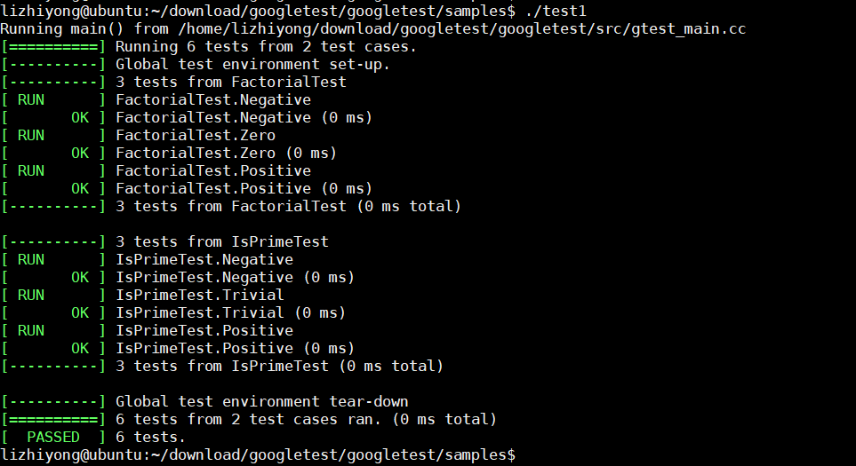

# 5.2 gtest单元测试

gtest是Google的一套用于编写C++测试的框架，可以运行在很多平台上（包括Linux、Mac OS X、Windows、Cygwin等等）。基于xUnit架构。支持很多好用的特性，包括自动识别测试、丰富的断言、断言自定义、死亡测试、非终止的失败、生成XML报告等等。

* [1.gtest的优点](#1)
* [2.搭建测试框架](#2)
* [3.测试Demo](#3)
* [4.搭建测试工程](#4)


<h2 id="1">1.gtest的优点</h2>

好的测试应该有下面的这些特点，我们看看GTest是如何满足要求的。
* 测试应该是独立的、可重复的。一个测试的结果不应该作为另一个测试的前提。GTest中每个测试运行在独立的对象中。如果某个测试失败了，可以单独地调试它。
* 测试应该是有清晰的结构的。GTest的测试有很好的组织结构，易于维护。
* 测试应该是可移植和可复用的。有很多代码是不依赖平台的，因此它们的测试也需要不依赖于平台。GTest可以在多种操作系统、多种编译器下工作，有很好的可移植性。
* 测试失败时，应该给出尽可能详尽的信息。GTest在遇到失败时并不停止接下来的测试，而且还可以选择使用非终止的失败来继续执行当前的测试。这样一次可以测试尽可能多的问题。
* 测试框架应该避免让开发者维护测试框架相关的东西。GTest可以自动识别定义的全部测试，你不需要一一列举它们。
* 测试应该够快。GTest在满足测试独立的前提下，允许你复用共享数据，它们只需创建一次。
* GTest采用的是xUnit架构，你会发现和JUnit、PyUnit很类似，所以上手非常快。

<h2 id="2">2.搭建测试框架</h2>
gtest下载地址：[https://github.com/google/googletest](https://github.com/google/googletest)    

下载方法是：git clone https://github.com/google/googletest.git  
安装方法是：  
```
$ cd googletest
$ cmake .
$ make
```  
然后在lib目录下会生成：libgmock.a  libgmock_main.a  libgtest.a  libgtest_main.a  
最后我们再`sudo make install`。

<h2 id="3">3.测试Demo</h2>
* 第一步：假设我们的实现两个函数：  

```  
#include "sample1.h"

// Returns n! (the factorial of n).  For negative n, n! is defined to be 1.
int Factorial(int n) {
  int result = 1;
  for (int i = 1; i <= n; i++) {
    result *= i;
  }

  return result;
}

// Returns true iff n is a prime number.
bool IsPrime(int n) {
  // Trivial case 1: small numbers
  if (n <= 1) return false;

  // Trivial case 2: even numbers
  if (n % 2 == 0) return n == 2;

  // Now, we have that n is odd and n >= 3.

  // Try to divide n by every odd number i, starting from 3
  for (int i = 3; ; i += 2) {
    // We only have to try i up to the square root of n
    if (i > n/i) break;

    // Now, we have i <= n/i < n.
    // If n is divisible by i, n is not prime.
    if (n % i == 0) return false;
  }

  // n has no integer factor in the range (1, n), and thus is prime.
  return true;
}

```
这两个函数定义在sample1.cc文件里，函数申明在sample1.h里：
```
#ifndef GTEST_SAMPLES_SAMPLE1_H_
#define GTEST_SAMPLES_SAMPLE1_H_

// Returns n! (the factorial of n).  For negative n, n! is defined to be 1.
int Factorial(int n);

// Returns true iff n is a prime number.
bool IsPrime(int n);

#endif 

```
* 第二步：现在我们就是要测试Factorial和IsPrime两个函数是否正确，好了开始写我们的测试用例把。新建一个文件，命名为sample_unittest.cc，代码如下：  
```
#include <limits.h>
#include "sample1.h"
#include "gtest/gtest.h"
namespace {

TEST(FactorialTest, Negative) {
    // This test is named "Negative", and belongs to the "FactorialTest"
    // test case.
    EXPECT_EQ(1, Factorial(-5));
    EXPECT_EQ(1, Factorial(-1));
    EXPECT_GT(Factorial(-10), 0);
}

TEST(FactorialTest, Zero) {
    EXPECT_EQ(1, Factorial(0));
}

TEST(FactorialTest, Positive) {
    EXPECT_EQ(1, Factorial(1));
    EXPECT_EQ(2, Factorial(2));
    EXPECT_EQ(6, Factorial(3));
    EXPECT_EQ(40320, Factorial(8));
}

// Tests IsPrime()
TEST(IsPrimeTest, Negative) {
  EXPECT_FALSE(IsPrime(-1));
  EXPECT_FALSE(IsPrime(-2));
  EXPECT_FALSE(IsPrime(INT_MIN));
}

TEST(IsPrimeTest, Trivial) {
  EXPECT_FALSE(IsPrime(0));
  EXPECT_FALSE(IsPrime(1));
  EXPECT_TRUE(IsPrime(2));
  EXPECT_TRUE(IsPrime(3));
}

TEST(IsPrimeTest, Positive) {
  EXPECT_FALSE(IsPrime(4));
  EXPECT_TRUE(IsPrime(5));
  EXPECT_FALSE(IsPrime(6));
  EXPECT_TRUE(IsPrime(23));
}
}  // namespace
```
TEST是gtest的测试宏，我们的测试用例必须按照这样格式写，isPrimeTest是测试套的名字，一个测试套下可以有多个测试用例，那么Positive、Trivial就是我们测试用例的名称，EXPECT_EQ、EXPECT_FALSE和EXPECT_TRUE等等，都是gtest提供的测试断言，比如` EXPECT_EQ(1, Factorial(1));`就是表示Factorial(1)和1是不是相等的，如果是则表示EXPECT_EQ会返回成功，否则失败，也即我们测试用例会失败或者成功。

* 第三步，实现测试的main函数，当然我们也可以不用写main函数，那就需要连接gtest_main.a这个库。比如这样子编译：
```
g++ sample1.cc sample1_unittest.cc -lgtest -std=c++11 -lgtest_main -lpthread -o test1
```
然后运行测试程序test：
```
$ ./test
```
会有以下输出：

或者是自己写一个main函数，函数定义如下：
```
#include <gtest/gtest.h>
int main(int argc, char** argv){
    testing::InitGoogleTest(&argc, argv);
    return RUN_ALL_TESTS();
}
```
然后编译成我们的测试程序就OK了，也许很多同学会很惊讶为什么RUN_ALL_TESTS函数后会，我们的测试程序就能自动运行了呢？
这是一个题外话，当然我觉得这也是gtest的一大亮点。有兴趣不？


