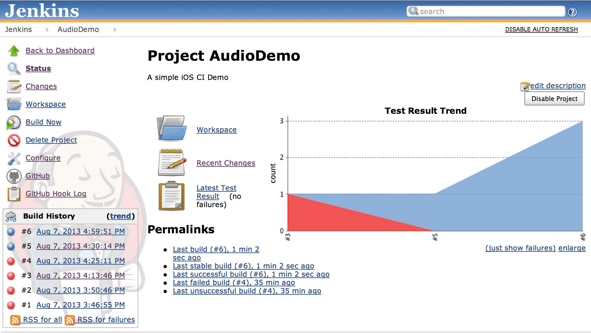

# 5.3 搭建持续集成环境

* [前言](#1)
* [传统开发方式的不足](#2)
* [持续集成的好处](#3)

<h2 id="1">前言</h2>

什么是持续集成，为什么要持续集成？例如我们搭建起来的一个持续集成环境：  

<h2 id="2">传统开发方式的不足</h2>

不足：
* 代码是静态的，只有测试人员手工测试才能发现问题，甚至有的时候根本就不知道是否能够编译出一个可测试的程序

* 所有的测试依赖手工测试，大量的测试活动重复进行；

* 大型团队大家相互之间的依赖很强，但是却不能确定自己是否基于一个完整和高质量的版本上开发。

* 如果有问题，并不能及时发现；

<h2 id="3">持续集成的好处</h2>

1.频繁检出代码。
有时候代码冲突无可避免，频繁检出代码，可以让本地的副本和代码库中的版本最小差异化。

2.频繁提交代码。
与1的原理类似，频繁提交代码，可以让其他人检出副本和代码库中的版本最小差异化。

3.减少分支，回归主干。
多个分支并行应及早将变更集成到主干中，避免同时维护软件的多个版本。

4.使用自动化构建。
可以使用Maven、Ant等来实现自动化构建，可以在构建过程中实现自动化测试。前提是有写单元测试用例。

5.提交测试。
在提交工作之前，每个程序员必须本地集成所有代码，做一个完整的构建和运行，并通过所有的单元测试，这样能减少集成测试在集成服务器上构建失败的风险。

6.当前状态对每个人都可见。
集成服务器在持续集成过程中发现问题应及时发送邮件和短信给相关的干系人。

7.如果发现有代码的问题，可以revert掉某个人的提交

8.可以直接部署到生产环境，而且是自动化的。

9.可以做很多的静态检查，比如圈复杂度、测试覆盖率、cpp pclint等等，哦太多丰富的插件去帮大家管理代码了。
来个thrift的持续集成图吧：
[https://travis-ci.org/apache/thrift](https://travis-ci.org/apache/thrift)

