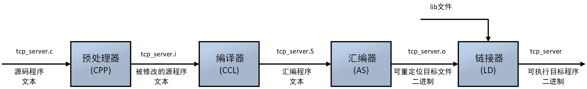
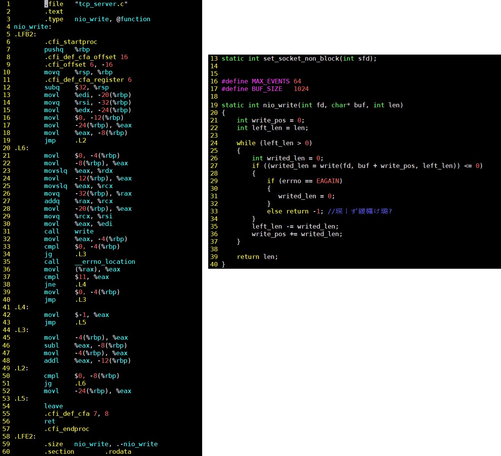

# 8.1 编译原理
* [前言](#1)
* [预处理](#2)
* [编译](#3)
* [汇编](#4)
* [链接](#4)

&emsp;&emsp;我们用C或者C++语言写好了源程序，但是这个代码只能让人读懂，却不能被机器读懂，为了在系统上运行这个程序，该源程序需要被转化为一系列低级机器语言指令，然后将这些指令按照可执行目标程序的格式打包并以二进制磁盘文件形式存储起来。最终在运行时，操作系统加载这个二进制文件，以进程的方式运行该程序。  
在linux系统可以通过下面这个方式，把源程序转化为目标程序。：  
```
gcc tcp_server.c -o tcp_server 
```
在这里，gcc这个编译工具帮我们把源码文件转换成了目标可执行程序（tcp_server），实际上，整个转换过程包括了预处理、编译、汇编和链接。那么gcc这个工具实际上分别使用预处理器、编译器、汇编器、链接器，也就是说这四个程序构成了编译系统。过程如下图：  

运行以下命令，我们可以查看到这四个阶段的处理对应的命令：  
```
$gcc --h
-E                       Preprocess only; do not compile, assemble or link
-S                       Compile only; do not assemble or link
-c                       Compile and assemble, but do not link
-o <file>                  Place the output into <file>

```
比如我们有一个程序tcp_server.c，源码为见https://github.com/zhiyong0804/socket/blob/master/tcp_server.c  

<h2 id="2">预处理</h2>  
&emsp;&emsp;预处理会将头文件包含进来，并且将宏定义替换调用，我们来看一下这个预处理过程，`gcc -E tcp_server.c -o tcp_server.i`。  

&emsp;&emsp;查看这个tcp_server.i这个文件，我们可以看到文件变得很大了，tcp_server.c里include的头文件里的内容都添加到这里了，同时宏定义也展开了。如下图：  
![8_2.png]  
&emsp;&emsp;同时，其实这个tcp_server.i还是一个c语言源程序，只不过不那么好看了而已。
<h2 id="3">编译</h2>    

&emsp;&emsp;编译器(CCL)将经过预处理器处理得到的文本文件tcp_server.i翻译成tcp_server.s，其中包含了汇编语言程序，汇编语言程序以一种标准的文本格式确切描述一条低级机器语言指令，那编译器主要干的事情就是：经过预编译得到的输出文件中，将只有常量。如数字、字符串、变量的定义，以及C语言的关键字，如main,if,else,for,while,{,},+,-,\*,\，等等。编译程序所要作得工作就是通过词法分析和语法分析等等，将其翻译成等价的中间代码表示或汇编代码。我们可以通过以下指令生成一条汇编代码`gcc -S tcp_server.i -o tcp_server.s`。


&emsp;&emsp;PS: 不同的编译器可能会有不同的调用约定，而调用约定会影响我们汇编程序的操作:  
  \__cdecl调用约定：
    1）参数入栈顺序是从右向左；
    2）在被调用函数返回后，由调用方调整堆栈。
  \__stdcall调用约定：
    1）参数从右向左压入堆栈； 
    2）函数自身清理堆栈； 
    3）函数名自动加前导的下划线，后面紧跟一个@符号，其后紧跟着参数的尺寸；
    4）函数参数个数不可变。
 \__fastcall调用约定：
    1） 函数的第一个和第二个参数通过寄存器传递，其他参数通过从右向左的顺序压栈；
    2）被调用者清理堆栈； 
    3）函数名修改规则同stdcall。
  \__thiscall调用约定：
    1） 参数从右向左入栈；
    2） 如果参数个数确定，this指针通过寄存器传递；如果参数个数不确定，this指针最后被压入堆栈；  
    3）对参数个数不定的，调用者清理堆栈，否则函数自己清理堆栈。

&emsp;&emsp;另外编译时还可以做一些优化，优化一种是对中间代码的优化。这种优化不依赖于具体的计算机。另一种优化则主要针对目标代码的生成而进行的。  
&emsp;&emsp;对于前一种优化，主要的工作是删除公共表达式、循环优化（代码外提、强度削弱、变换循环控制条件、已知量的合并等）、复写传播，以及无用赋值的删除，等等。  
&emsp;&emsp;后一种类型的优化同机器的硬件结构密切相关，最主要的是考虑是如何充分利用机器的各个硬件寄存器存放的有关变量的值，以减少对于内存的访问次数。  
&emsp;&emsp;我们在使用gcc/g++编译程序的时候也可以通过-O选项指定优化等级：主要有0,1,2,3和s等5种级别的优化，0表示没有任何优化，但是我们不推荐采用O3和Os级别的优化，因为可能会导致一些不可预期的错误。


<h2 id="3">汇编</h2> 
&emsp;&emsp;汇编器(AS)将tcp_server.s翻译成机器语言指令，并打包成可重定位目标程序，一般以.o为文件扩展名。可重定位目标程序是二进制文件，它的字节编码是机器语言指令而不是字符。

&emsp;&emsp;运行以下指令可得到重定位目标程序tcp_server.o：  
```
gcc -c tcp_server.s -o tcp_server.o
```
&emsp;&emsp;.o和.a，都是可重定向文件，我们可以通过`file tcp_server.o`来查看文件类型，比如：
`tcp_server.o: ELF 64-bit LSB relocatable, x86-64, version 1 (SYSV), not stripped`
&emsp;&emsp;.o和.a是符合ELF格式的，对于ELF格式大家可以课外脑补下，我们先通过objdump(objdump -h tcp_server.o)来查看文件结构：
```
tcp_server.o:     file format elf64-x86-64

Sections:
Idx Name          Size      VMA               LMA               File off  Algn
  0 .text         000006be  0000000000000000  0000000000000000  00000040  2**0
                  CONTENTS, ALLOC, LOAD, RELOC, READONLY, CODE
  1 .data         00000000  0000000000000000  0000000000000000  000006fe  2**0
                  CONTENTS, ALLOC, LOAD, DATA
  2 .bss          00000000  0000000000000000  0000000000000000  000006fe  2**0
                  ALLOC
  3 .rodata       000001db  0000000000000000  0000000000000000  00000700  2**3
                  CONTENTS, ALLOC, LOAD, READONLY, DATA
  4 .comment      00000035  0000000000000000  0000000000000000  000008db  2**0
                  CONTENTS, READONLY
  5 .note.GNU-stack 00000000  0000000000000000  0000000000000000  00000910  2**0
                  CONTENTS, READONLY
  6 .eh_frame     00000098  0000000000000000  0000000000000000  00000910  2**3
                  CONTENTS, ALLOC, LOAD, RELOC, READONLY, DATA

```
&emsp;&emsp;具体解释大家可以参考这篇博文：[https://blog.csdn.net/xuehuafeiwu123/article/details/72963229](https://blog.csdn.net/xuehuafeiwu123/article/details/72963229)。另外我们也可以查看elf里的内容，比如`objdump -s -d tcp_server.o`。
```
lizhiyong@ubuntu:~/socket$ objdump -s -d tcp_server.o

tcp_server.o:     file format elf64-x86-64

Contents of section .text:
 0000 554889e5 4883ec20 897dec48 8975e089  UH..H.. .}.H.u..
 0010 55e8c745 f4000000 008b45e8 8945f8eb  U..E......E..E..
 0020 58c745fc 00000000 8b45f848 63d08b45  X.E......E.Hc..E
 0030 f44863c8 488b45e0 4801c18b 45ec4889  .Hc.H.E.H...E.H.
 0040 ce89c7e8 00000000 8945fc83 7dfc007f  .........E..}...
 0050 1ce80000 00008b00 83f80b75 09c745fc  ...........u..E.
 0060 00000000 eb07b8ff ffffffeb 158b45fc  ..............E.
 0070 2945f88b 45fc0145 f4837df8 007fa28b  )E..E..E..}.....
 0080 45e8c9c3 554889e5 4883ec70 89f86689  E...UH..H..p..f.
 0090 459c6448 8b042528 00000048 8945f831  E.dH..%(...H.E.1
 00a0 c0ba0000 0000be01 000000bf 02000000  ................
 00b0 e8000000 008945a4 837da400 7914bf00  ......E..}..y...
 00c0 000000e8 00000000 b8ffffff ffe99600  ................
 00d0 0000c745 a8010000 00488d45 e0ba1000  ...E.....H.E....
 00e0 0000be00 00000048 89c7e800 00000066  .......H.......f
 00f0 c745e002 000fb745 9c89c7e8 00000000  .E.....E........
 0100 668945e2 c745e400 00000048 8d4de08b  f.E..E.....H.M..
 0110 45a4ba10 00000048 89ce89c7 e8000000  E......H........
 0120 0085c079 14bf0000 0000e800 000000bf  ...y............
 0130 01000000 e8000000 008b45a4 be800000  ..........E.....
 0140 0089c7e8 00000000 8945ac83 7dacff75  .........E..}..u
 0150 14bf0000 0000e800 000000bf 01000000  ................
 0160 e8000000 008b45a4 488b4df8 6448330c  ......E.H.M.dH3.
 0170 25280000 007405e8 00000000 c9c35548  %(...t........UH
 0180 89e54883 ec20897d ec8b45ec be030000  ..H.. .}..E.....
 0190 0089c7b8 00000000 e8000000 008945f8  ..............E.
 01a0 837df8ff 7514bf00 000000e8 00000000  .}..u...........
 01b0 bf010000 00e80000 0000814d f8000800  ...........M....
 01c0 008b55f8 8b45ecbe 04000000 89c7b800  ..U..E..........
 01d0 000000e8 00000000 8945fc83 7dfcff75  .........E..}..u

```
&emsp;&emsp;看不懂以上内容的没有关系（Lee哥也看不懂啊），objdump同时也反汇编了.text文件的内容，如下：
```
Disassembly of section .text:

0000000000000000 <nio_write>:
   0:   55                      push   %rbp
   1:   48 89 e5                mov    %rsp,%rbp
   4:   48 83 ec 20             sub    $0x20,%rsp
   8:   89 7d ec                mov    %edi,-0x14(%rbp)
   b:   48 89 75 e0             mov    %rsi,-0x20(%rbp)
   f:   89 55 e8                mov    %edx,-0x18(%rbp)
  12:   c7 45 f4 00 00 00 00    movl   $0x0,-0xc(%rbp)
  19:   8b 45 e8                mov    -0x18(%rbp),%eax
  1c:   89 45 f8                mov    %eax,-0x8(%rbp)
  1f:   eb 58                   jmp    79 <nio_write+0x79>
  21:   c7 45 fc 00 00 00 00    movl   $0x0,-0x4(%rbp)
  28:   8b 45 f8                mov    -0x8(%rbp),%eax
  2b:   48 63 d0                movslq %eax,%rdx
  2e:   8b 45 f4                mov    -0xc(%rbp),%eax
  31:   48 63 c8                movslq %eax,%rcx
  34:   48 8b 45 e0             mov    -0x20(%rbp),%rax
  38:   48 01 c1                add    %rax,%rcx
  3b:   8b 45 ec                mov    -0x14(%rbp),%eax
  3e:   48 89 ce                mov    %rcx,%rsi
  41:   89 c7                   mov    %eax,%edi
  43:   e8 00 00 00 00          callq  48 <nio_write+0x48>
  48:   89 45 fc                mov    %eax,-0x4(%rbp)
  4b:   83 7d fc 00             cmpl   $0x0,-0x4(%rbp)
  4f:   7f 1c                   jg     6d <nio_write+0x6d>
  51:   e8 00 00 00 00          callq  56 <nio_write+0x56>
  56:   8b 00                   mov    (%rax),%eax
  58:   83 f8 0b                cmp    $0xb,%eax
  5b:   75 09                   jne    66 <nio_write+0x66>
  5d:   c7 45 fc 00 00 00 00    movl   $0x0,-0x4(%rbp)
  64:   eb 07                   jmp    6d <nio_write+0x6d>
  66:   b8 ff ff ff ff          mov    $0xffffffff,%eax
  6b:   eb 15                   jmp    82 <nio_write+0x82>
  6d:   8b 45 fc                mov    -0x4(%rbp),%eax
  70:   29 45 f8                sub    %eax,-0x8(%rbp)
  73:   8b 45 fc                mov    -0x4(%rbp),%eax
  76:   01 45 f4                add    %eax,-0xc(%rbp)
  79:   83 7d f8 00             cmpl   $0x0,-0x8(%rbp)
  7d:   7f a2                   jg     21 <nio_write+0x21>
  7f:   8b 45 e8                mov    -0x18(%rbp),%eax
  82:   c9                      leaveq
  83:   c3                      retq

```
<h2 id="4">链接</h2>
&emsp;&emsp;由汇编程序生成的目标文件并不能立即就被执行，其中可能还有许多没有解决的问题。例如，某个源文件中的函数可能引用了另一个源文件中定义的某个符号（如变量或者函数调用等）；在程序中可能调用了某个库文件中的函数，等等。所有的这些问题，都需要经链接程序的处理方能得以解决。链接程序的主要工作就是将有关的目标文件彼此相连接，也即将在一个文件中引用的符号同该符号在另外一个文件中的定义连接起来，使得所有的这些目标文件成为一个能够被操作系统装入执行的统一整体。根据开发人员指定的同库函数的链接方式的不同，链接处理可分为两种：  

&emsp;&emsp; 1）静态链接  在这种链接方式下，函数的代码将从其所在地静态链接库中被拷贝到最终的可执行程序中。这样该程序在被执行时这些代码将被装入到该进程的虚拟地址空间中。静态链接库实际上是一个目标文件的集合，其中的每个文件含有库中的一个或者一组相关函数的代码。  
&emsp;&emsp; 2）动态链接  在此种方式下，函数的代码被放到称作是动态链接库或共享对象的某个目标文件中。链接程序此时所作的只是在最终的可执行程序中记录下共享对象的名字以及其它少量的登记信息。在此可执行文件被执行时，动态链接库的全部内容将被映射到运行时相应进程的虚地址空间。动态链接程序将根据可执行程序中记录的信息找到相应的函数代码。  
&emsp;&emsp;我们可以通过`gcc tcp_server.o -o tcp_server `生成可执行程序。可执行程序也是符合ELF格式的。
>问题：编译时我们为什么有时候需要指定-fPIC参数？  
&emsp;&emsp;如果我们编译一个简单的程序，直接命令行gcc -o xxx  ooo ttt等方式就能编译了，但是往往一个大型工程是不止一两个文件的，用命令行的方式岂不是要输入所有的源码文件到命令行，那又如何编译我们的工程呢？


