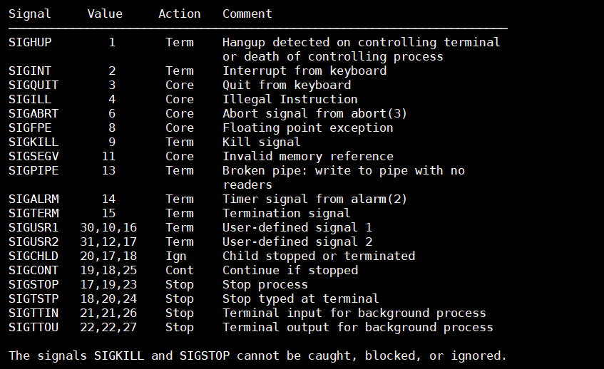
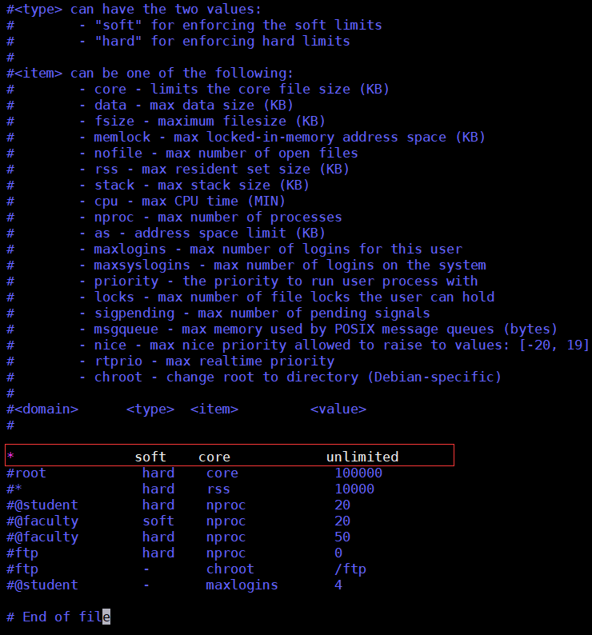
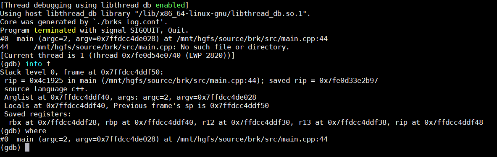

# 9.2 coredump
* [coredump是什么](#1)
* [前期设置](#2)
* [使用gdb调试coredump文件](#3)
* [奔溃日志](#4)


<h3 id="1">coredump是什么</h3>
&emsp;&emsp;程序异常退出时，会产生一个core文件，该文件记录了程序运行时的内存，寄存器状态，堆栈指针，内存管理信息还有各种函数调用堆栈信息等，我们可以理解为是程序工作当前状态存储生成的一个文件，通过工具分析这个文件，我们可以定位到程序异常退出的时候对应的堆栈调用等信息，找出问题所在并进行及时解决。

&emsp;&emsp;上面说当程序运行过程中异常终止或崩溃时会发生 core dump，但还没说到什么具体的情景程序会发生异常终止或崩溃，例如我们使用 kill -9 命令杀死一个进程会发生 core dump 吗？实验证明是不能的，那么什么情况会产生呢？  
&emsp;&emsp;Linux 中信号是一种异步事件处理的机制，每种信号对应有其默认的操作，你可以在 这里 查看 Linux 系统提供的信号以及默认处理。默认操作主要包括忽略该信号（Ingore）、暂停进程（Stop）、终止进程（Terminate）、终止并发生core dump（core）等。如果我们信号均是采用默认操作，那么，以下列出几种信号，它们在发生时会产生 core dump，这个可以通过`man 7 signal`:

&emsp;&emsp;当然不仅限于上面的几种信号。这就是为什么我们使用 Ctrl+z 来挂起一个进程或者 Ctrl+C 结束一个进程均不会产生 core dump，因为前者会向进程发出 SIGTSTP 信号，该信号的默认操作为暂停进程（Stop Process）；后者会向进程发出SIGINT 信号，该信号默认操作为终止进程（Terminate Process）。同样上面提到的 kill -9 命令会发出 SIGKILL 命令，该命令默认为终止进程。而如果我们使用 Ctrl+\ 来终止一个进程，会向进程发出 SIGQUIT 信号，默认是会产生 core dump 的。还有其它情景会产生 core dump， 如：程序调用 abort() 函数、访存错误、非法指令等等。

<h3 id="2">前期设置</h3>
1. 设置core文件生成的目录，其中%e表示程序文件名，%p表示进程ID，否则会在程序的当前目录生成dore文件；

```
	 echo /data/coredump/core.%e.%p >/proc/sys/kernel/core_pattern   
```
2. 当前执行程序的用户对core目录有写权限且有足够的空间存储core文件；
   	
3. 生成不受限制的core文件，`ulimit  -c unlimited`，这个只会对当前的终端有效，如果想永久有效，需要修改文件：/etc/security/limits.conf，增加一行，如下红圈所示：  



<h3 id="3">使用gdb调试coredump文件</h3>
&emsp;&emsp;产生了 core 文件，我们该如何使用该 Core 文件进行调试呢？Linux 中可以使用 GDB 来调试 core 文件，命令如下：

```
gdb program core
```
program是程序名称，core是coredump文件。OK，我们来动手吧，动手，动手，动手，当你看见一个前凸后翘的美女时，你先去了解她，制定攻略，那接下来是不是要动手实践呢？so 动手，只看书不动手永远很难了解哪些理论，即使水平再高也需要动手解决问题，才能有更深刻的认识，其实，也就是说再漂亮的女人，也需要个男人对她动粗，你说是不是？   
&emsp;&emsp;比如：

那都有哪些操作命令可以调试这个coredump文件呢？
* bt或者where查看调用栈信息
      如果你要查看某一层的信息，你需要切换当前的栈，一般来说，程序停止时，最顶层的栈就是当前栈，如果你要查看栈下面层的详细信息，首先要做的是切换当前栈。  
* frame \<n>和 f \<n>   
&emsp;&emsp;n是一个从0开始的整数，是栈中的层编号。比如：frame 0，表示栈顶，frame 1，表示栈的第二层。
* up <n>  
&emsp;&emsp;表示向栈的上面移动n层，可以不打n，表示向上移动一层。 
* down <n> 
        表示向栈的下面移动n层，可以不打n，表示向下移动一层。   
		
&emsp;&emsp;上面的命令，都会打印出移动到的栈层的信息。如果你不想让其打出信息。你可以使用这三个命令：
```
            select-frame <n> 对应于 frame 命令。
            up-silently <n> 对应于 up 命令。
            down-silently <n> 对应于 down 命令。
```
&emsp;&emsp;查看当前栈层的信息，你可以用以下GDB命令：
* frame 或 f 
&emsp;&emsp;会打印出这些信息：栈的层编号，当前的函数名，函数参数值，函数所在文件及行号，函数执行到的语句。
* info frame 和 info f 
&emsp;&emsp;这个命令会打印出更为详细的当前栈层的信息，只不过，大多数都是运行时的内内地址。比如：函数地址，调用函数的地址，被调用函数的地址，目前的函数是由什么样的程序语言写成的、函数参数地址及值、局部变量的地址等等。

<h3 id="4">奔溃日志</h3>
&emsp;&emsp;生成coredump去用gdb调试还是依赖我们是否生成调试信息，如果我们的没有添加-g选项就麻烦了，此时我们可以怎么办呢？  
&emsp;&emsp;上文说过程序崩溃（core）了是由一些信号触发的，这些信号也许是因为用户操作，也许是我们程序有一些错误的指令（比如对空指针的赋值，除数为零）触发的。那么我们程序实际上是可以捕获这些信号的，然后去打印堆栈的信息，how to do？  
&emsp;&emsp;signal是一个截取信号的函数，它的申明如下：

```
#include <signal.h>

typedef void (*sighandler_t)(int);

sighandler_t signal(int signum, sighandler_t handler);
```
signal截取信号，然后调用回调函数handler处理信号，那么其实我们就可以在handler函数里打印堆栈信息，backtrace获取堆栈的大小，并且把堆栈的信息放在array指向的内存中，然后调用backtrace_symbols把堆栈中的函数信息转换成函数名。例如：
```
int main(int argc, char** argv)
{
    signal(SIGSEGV, handle_segv); // SIGSEGV    11  Core Invalid memory reference
    signal(SIGABRT, handle_segv); // SIGABRT    6       Core Abort signal from
	signal(SIGINT, handle_segv);
	signal(SIGTSTP, handle_segv);
	signal(SIGTERM, handle_segv);

    //...
	
	return 0;
}
void handle_segv(int signum)
{
    void *array[100];
    size_t size;
    char **strings;
    size_t i;
	
    signal(signum, SIG_DFL); /* 还原默认的信号处理handler */

    size = backtrace (array, 100);
    strings = (char **)backtrace_symbols (array, size);
	
	// 这里是打印到日志中，其实也可以打印到某个文件中
    LOG_INFO("Launcher received SIG: %d Stack trace:\n", signum);
    for (i = 0; i < size; i++)
    {
        LOG_ERROR("%d %s \n",i,strings[i]);
    }

    free (strings);
	//g_launcher->stop();
}

```
&emsp;&emsp;从上文，我们也可以看出我们在程序崩溃前可以做一些善后处理。


**最后，链接一本电子书给大家[https://wizardforcel.gitbooks.io/100-gdb-tips/index.html](https://wizardforcel.gitbooks.io/100-gdb-tips/index.html)**