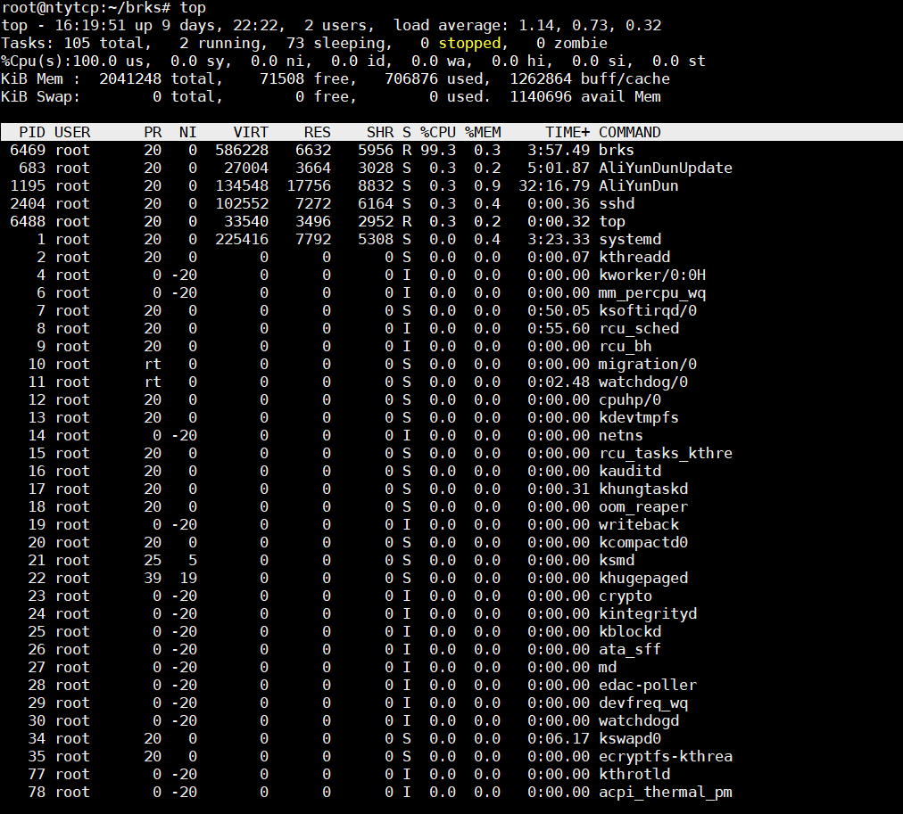

# 9.3 内存泄漏检查
* [怎么就知道内存泄漏了](#1)
* [如何定位内存泄漏](#2)

<h3 id="1">怎么就知道内存泄漏了</h3> 
&emsp;&emsp;我们如果不去特意查内存泄漏，实际上是很难发现的，因为这个程序即使发生内存泄漏，他也不会有任何特征（泄漏速度不是很快），知道某一天，我们发现系统运行变慢了，或者出现了其它莫名其妙的问题，等到我们把系统重启，发现整个程序运行又正常了，这大致就是内存泄漏遇见我们时，玩的捉迷藏游戏。因为程序是一个动态运行的过程，所以我们很难发现一定就内存泄漏了，那可以先用top命令跟踪下某个进程，哦先来了解top命令：

&emsp;&emsp;在终端上敲入top命令，显示结果如下：

&emsp;&emsp;top命令是Linux下常用的性能分析工具，能够实时显示系统中各个进程的资源占用状况，类似于Windows的任务管理器。top是一个动态显示过程,即可以通过用户按键来不断刷新当前状态.如果在前台执行该命令,它将独占前台,直到用户终止该程序为止.比较准确的说,top命令提供了实时的对系统处理器的状态监视.它将显示系统中CPU最“敏感”的任务列表.该命令可以按CPU使用.内存使用和执行时间对任务进行排序；而且该命令的很多特性都可以通过交互式命令或者在个人定制文件中进行设定。
* 第一行
   * 16:19:51 ：系统当前时间
   * up 9 days, 22:22 ：系统开机到现在经过了多少时间
   * 2 users ：当前两个用户在线
   * 1.14, 0.73, 0.32 ：系统1分钟、5分钟、15分钟的CPU负载信息
* 第二行
   * Tasks ：任务
   * 105 total ：很好理解，就是当前有87个任务，也就是87个进程。
   *  2 running ：两个进程正在运行
   *  73 sleeping ：73个进程正在休眠
   *  0 stopped：停止的进程数
   *  0 zombie：僵尸进程数
 * 第三行
   * %Cpu(s): 表示这一行显示CPU总体信息
   * 100.0 us：用户态进程占用CPU时间百分比，不包含renice值为负的任务占用的CPU的时间。
   * 0.0 sy：内核占用CPU时间百分比
   * 0.0 ni：改变过优先级的进程占用CPU的百分比
   * 0.0 id：空闲CPU时间百分比
   * 0.0 wa：等待I/O的CPU时间百分比
   * 0.0 hi：CPU硬中断时间百分比
   * 0.0 si：CPU软中断时间百分比
   * 0.0 st： 
注：这里显示数据是所有cpu的平均值，如果想看每一个cpu的处理情况，按1即可；折叠，再次按1；
* 第四行
   * Mem : 内存的信息
   * 2041248 total：物理内存总量
   * 71508 free：空闲的物理内存量
   * 706876 used：使用的物理内存量
   * 1262864 buff/cache ：用作内核缓存的物理内存量
 * 第五行
   * Swap: 虚拟内存使用（交换空间）
   * 0 total：交换区总量
   * 0 free：空闲
   * 0 used：使用
   * 1140696 avail Mem ：缓存交换空间
以下就是是以列显示的进程。不同的列代表下面要解释的不同属性。默认上，top显示这些关于进程的属性：
* PID：进程ID，进程的唯一标识符
* USER：进程所有者的实际用户名。
* PR：进程的调度优先级。这个字段的一些值是'rt'。这意味这这些进程运行在实时态。
* NI：进程的nice值（优先级）。越小的值意味着越高的优先级。
* VIRT：进程使用的虚拟内存。
* RES：驻留内存大小。驻留内存是任务使用的非交换物理内存大小。
* SHR：SHR是进程使用的共享内存。
* S ：这个是进程的状态。它有以下不同的值:
   * D - 不可中断的睡眠态。
   * R – 运行态
   * S – 睡眠态
   * T – 被跟踪或已停止
   * Z – 僵尸态
* %CPU：自从上一次更新时到现在任务所使用的CPU时间百分比。
* %MEM：进程使用的可用物理内存百分比。
* TIME+：任务启动后到现在所使用的全部CPU时间，精确到百分之一秒。
* COMMAND：运行进程所使用的命令。 

**下面列出一些常用的 top命令操作指令**

* q：退出top命令
* \<Space>：立即刷新
* s：设置刷新时间间隔
* c：显示命令完全模式
* t:：显示或隐藏进程和CPU状态信息
* m：显示或隐藏内存状态信息
* l：显示或隐藏uptime信息
* f：增加或减少进程显示标志
* S：累计模式，会把已完成或退出的子进程占用的CPU时间累计到父进程的MITE+
* P：按%CPU使用率排行
* T：按MITE+排行
* M：按%MEM排行
* u：指定显示用户进程
* r：修改进程renice值
* kkill：进程
* i：只显示正在运行的进程
* W：保存对top的设置到文件^/.toprc，下次启动将自动调用toprc文件的设置。
* h：帮助命令。
* q：退出
* 注：强调一下，使用频率最高的是P、T、M，因为通常使用top，我们就想看看是哪些进程最耗cpu资源、占用的内存最多； 注：通过”shift + >”或”shift + \<”可以向右或左改变排序列 如果只需要查看内存：可用free命令。只查看uptime信息（第一行），可用uptime命令；

&emsp;&emsp;从以上的介绍我们可以清楚的指导top命令其实可以干很多的事情，比如CPU信息，比如中断信息等等，当然我们也可以使用free和vmstat命令查询可用内存，那么一般我们持续观察某个进程或者相关的进程的内存使用情况，如果内存使用量持续或者螺旋震荡向上增长，那么很有可能发生了内存泄漏。调试和观察手段除了这些实际上还有很多，比如pstack、strace、ipcs、iostat、sar和netstat等等。  
&emsp;&emsp;那么

<h3 id="2">如何定位内存泄漏</h3> 
&emsp;&emsp;Valgrind是运行在Linux上一套基于仿真技术的程序调试和分析工具，作者是获得过Google-O'Reilly开源大奖的Julian Seward，它包含一个内核──一个软件合成的CPU，和一系列的小工具，每个工具都可以完成一项任务──调试，分析，或测试等，内存检测，我们可以使用它的工具：Memcheck。

**Valgrind 安装**
* 方法 1.  valgrind官网：http://valgrind.org下载

* 方法 2.  Ubuntu  sudo apt-get install valgrind

**Memcheck检测范围**
   用来检测c/c++程序中出现的内存问题，所有对内存的读写都会被检测到，一切对malloc()/free()/new/delete的调用都会被捕获。所以，它能检测以下问题： 

1. 对未初始化内存的使用； 

2. 读/写释放后的内存块；
 
3. 读/写超出malloc等分配的动态内存范围； 

4. 读/写不适当的栈中内存块； 

5. 内存泄漏，指向一块内存的指针永远丢失； 

6. 不正确的malloc/free或new/delete匹配； 

7.  memcpy()相关函数中的dst和src指针重叠问题。 

**Memcheck 检查步骤及注意事项**
1.在编译程序的时候打开调试模式（gcc编译器的-g选项），以便显示行号，编译时去掉-O1 -O2等优化选项;检查的是C++程序的时候，考虑加上选项： -fno-inline ,这样它函数调用链会很清晰

2. 执行：valgrind --tool=memcheck --leak-check=full --log-file=./log.txt  ./YourProgram
  
3.程序运行结束，查看 log.txt 中的结果。

**结果分析**
Valgrind(memcheck)包含这7类错误：

1.illegal read/illegal write errors    非法读取/非法写入错误

2.use of uninitialised values        使用未初始化的区域

3.use of uninitialised or unaddressable values in system calls 系统调用时使用了未初始化或不可寻址的地址

4.illegal frees   非法的释放

5.when a heap block is freed with an inappropriate deallocation function 分配和释放函数不匹配

6.overlapping source and destination blocks   源和目的内存块重叠

7.memory leak detection    内存泄漏检测
	
* 7.1 Still reachable 
	内存指针还在还有机会使用或者释放，指针指向的动态内存还没有被释放就退出了
* 7.2 Definitely lost 
	确定的内存泄露，已经不能够访问这块内存
* 7.3 Indirectly lost 
	指向该内存的指针都位于内存泄露处
* 7.4 Possibly lost 
	可能的内存泄露，仍然存在某个指针能够访问某块内存，但该指针指向的已经不是该内
存首位置
* 7.5 Suppressed  某些库产生的错误不予以提示，这些错误会被统计到suppressed项目
